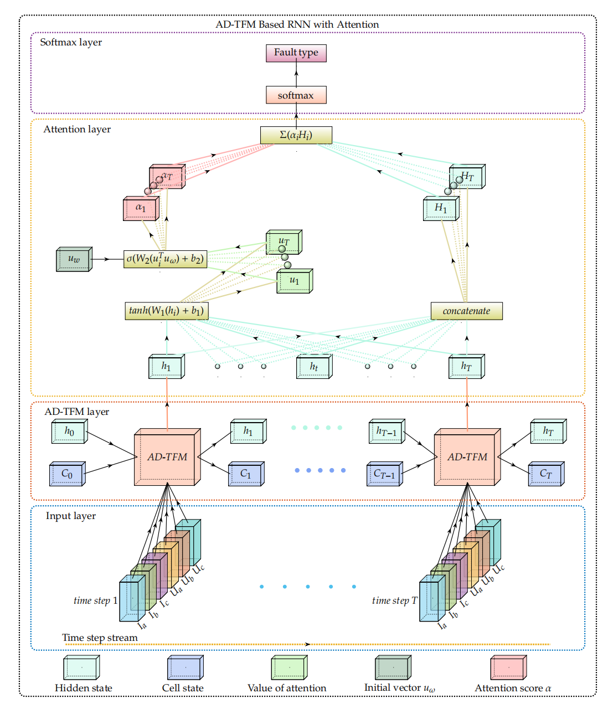
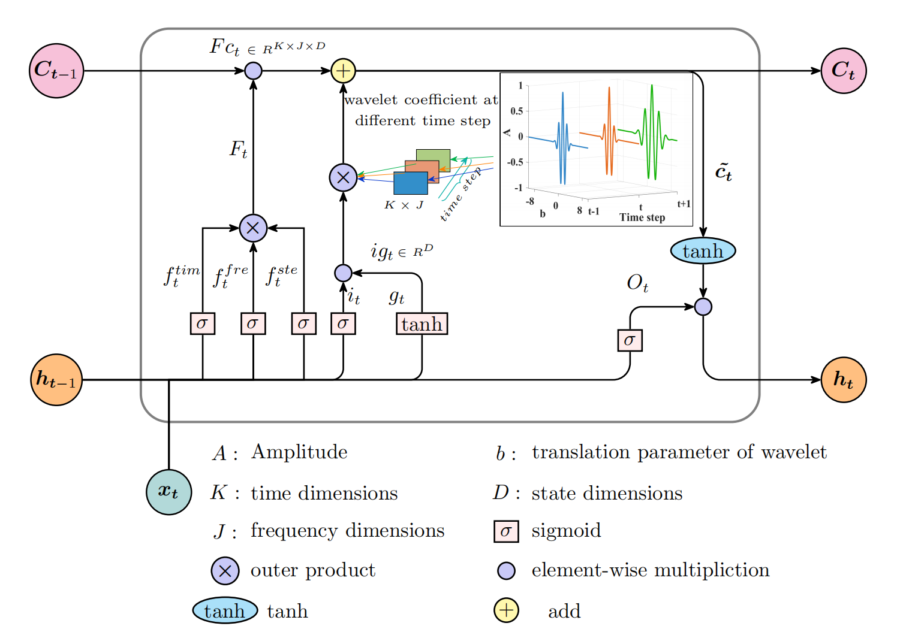
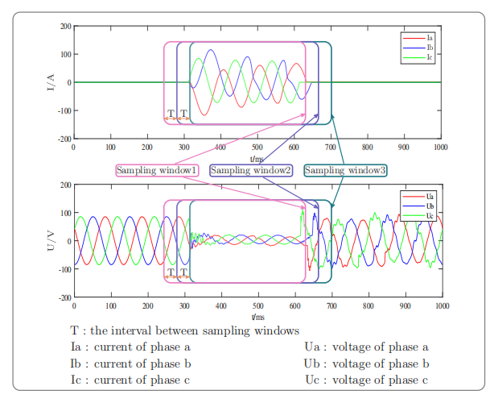
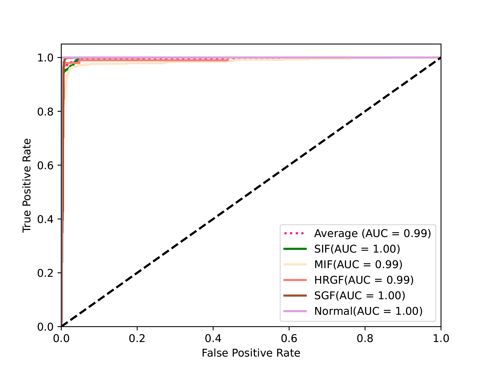
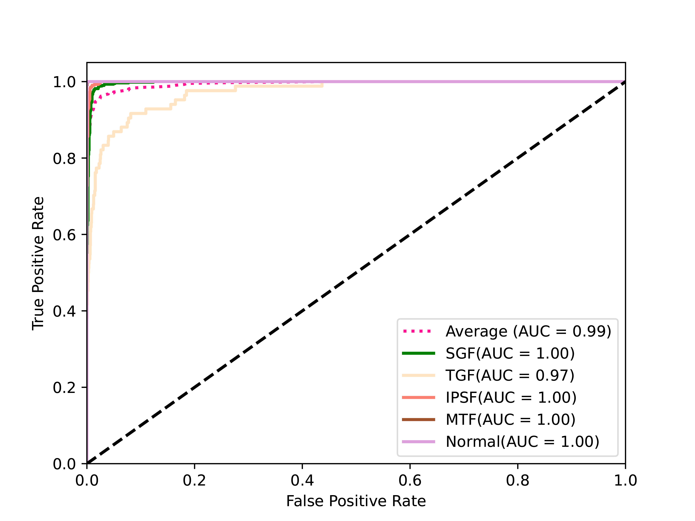

<h1 align="center">⚡ Incipient Fault Detection in Power Distribution System: A Time–Frequency Embedded Deep-Learning Based Approach</h1>

<p align="center">
  <i>Official implementation of the IEEE Transactions on Instrumentation and Measurement (TIM), 2023</i>
</p>

<p align="center">
  <b>AD-TFM-AT Model: Adaptive Wavelet Transform × LSTM × Attention</b>
</p>

<p align="center">
  
  
  
  
  
</p>


---

## ⭐ Overview

AD-TFM-AT is designed for early-stage (incipient) fault detection in distribution networks,  
where fault signatures are typically  **nonstationary**, and **short-duration**.

The model integrates:

- 🔵 **Adaptive Wavelet Transform (AWT)** – extracts multi-resolution transient features  
- 🟢 **LSTM modules** – model temporal dependencies  
- 🟠 **Attention layers** – enhance relevant fault patterns  
- ⚡ Full end-to-end training in TensorFlow-GPU  

This hybrid framework achieves high accuracy on both **IFPD** and **SGAH** datasets.

---

## 🚀 Key Contributions (from the Paper)

### ✔ 1. **Adaptive Wavelet + LSTM Hybrid Cell (AD-TFM)**  
A novel LSTM cell embedding learnable wavelet transform to capture multi-scale fault features.

### ✔ 2. **Attention-Enhanced AD-TFM-AT Network**  
Attention improves the discrimination of weak or noisy incipient fault signatures.

### ✔ 3. **Two Data Augmentation Strategies**  
- **Phase Switching (PS)**  
- **Temporal Sliding (TS)**  
Effectively expands limited incipient fault datasets.

---
## 📐 Model Architecture

### 🔹 Full AD-TFM-AT Network

<p align="center">
  
</p>

### 🔹 AD-TFM Cell Structure And  Data Augmentation (Phase Switching + Temporal Sliding)

<p align="center">
  
  
</p>

---

## 🔧 Requirements

The model is implemented under the following environment:

```

Python 3.6
TensorFlow-GPU 1.14.0
Keras 2.2.5

````

Install via:

```bash
pip install -r requirements.txt
````

---

## 🚀 Train & Test

Run the following command to train and evaluate the model:

```bash
python test_tf.py
```

Modify hyperparameters directly inside the script for custom experiments.

---

## 📡 Datasets

### **1️⃣ IFPD Dataset (Incipient Fault Dataset)**

Source:
[https://dx.doi.org/10.21227/bwjy-7e05](https://dx.doi.org/10.21227/bwjy-7e05)

### **2️⃣ SGAH Dataset (State Grid Anhui Province)**

GitHub:
[https://github.com/smartlab-hfut/SGAH-datasets.git](https://github.com/smartlab-hfut/SGAH-datasets.git)

---

## 🛠 Training Configuration (from Table I)

| Parameter            | Value                      |
| -------------------- | -------------------------- |
| Optimizer            | Adam (lr=0.001, eps=1e-08) |
| Batch Size           | 256 / 800                  |
| Hidden Dim (D)       | 32                         |
| Time Scales (K)      | 4                          |
| Frequency Scales (J) | 4                          |
| Wavelet ω₀           | 16                         |

---

## 📊 Experimental Results

### 🔹 Detection Performance on IFPD & SGAH

| Dataset  | Accuracy | Precision | Recall | F1-score |
| -------- | :------: | :-------: | :----: | :------: |
| **IFPD** |   0.97   |    0.97   |  0.96  |   0.96   |
| **SGAH** |   0.99   |    0.97   |  0.98  |   0.98   |

---

### 🔹 ROC Curves

#### **IFPD Dataset** and **SGAH Dataset**

<p align="center">
  
    
</p>


## 📚 References

```bibtex
@article{autonomous2022,
  author={Li, Qiyue and Deng, Yuxing and Liu, Xin and Sun, Wei and Li, Weitao and Li, Jie and Liu, Zhi},
  title={Autonomous Smart Grid Fault Detection},
  journal={arXiv e-prints},
  year={2022},
  doi={10.48550/arXiv.2206.14150}
}

@article{li2022resource,
  title={Resource Orchestration of Cloud-edge based Smart Grid Fault Detection},
  author={Li, Jie and Deng, Yuxing and Sun, Wei and Li, Weitao and Li, Ruidong and Li, Qiyue and Liu, Zhi},
  journal={ACM Transactions on Sensor Networks (TOSN)},
  year={2022}
}
```

---

## 📬 Contact

For questions or discussions:

* **Huan Luo**, Hefei University of Technology
  ✉️ [luohuan@mail.hfut.edu.cn](mailto:luohuan@mail.hfut.edu.cn)


